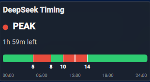

# DeepSeek Timing Plasmoid for KDE Plasma 6


A native KDE Plasma 6 desktop widget that tracks DeepSeek API pricing tiers in real time. It displays current Peak vs. Off-Peak status, time remaining until the next status transition, and a 24-hour horizontal timeline bar with dynamic peak hour markers.

## Features

* **Real-time Status Tracking:** Automatically detects whether the DeepSeek API is currently in **Peak** or **OFF-PEAK** pricing hours.
* **Countdown Timer:** Displays remaining hours, minutes, and seconds until the next price change.
* **Interactive Timeline Bar:**
  * Displays 24-hour horizontal track with visual red peak windows.
  * Shows exact local peak hour start and end ticks (`5`, `8`, `10`, `14`).
  * Real-time needle indicator indicating current day progress.
* **Full Native RTL & Arabic Support:**
  * Complete Arabic localizations (`توقيت ديب سيك`, `ذروة`, `خارج الذروة`).
  * Right-to-Left (RTL) timeline coordinate inversion for natural right-to-left time flow.
* **Plasma 6 Native:** Designed using Qt 6, QML, and native `PlasmaComponents3` framework elements.

## Screenshots



## Installation

### Method 1: Using `kpackagetool6` (Recommended)

1. Clone the repository:
   ```bash
   git clone https://github.com/zayedalsaidi/org.kde.deepseekstatus.git
   cd org.kde.deepseekstatus

    ```

2. Install the widget to your local Plasma applet directory:
    ```bash
    kpackagetool6 --type=Plasma/Applet --install .

    ```

3. Rebuild the system cache and restart `plasmashell`:
    ```bash
    kbuildsycoca6 --noincremental
    plasmashell --replace &

    ```
## DeepSeek API Peak Schedule

DeepSeek API peak pricing hours are based on standard UTC windows:

* **Peak Window 1:** `01:00 UTC` – `04:00 UTC` (Monday–Friday)
* **Peak Window 2:** `06:00 UTC` – `10:00 UTC` (Monday–Friday)
* **Off-Peak:** All other times and weekends.

> **Note:** The plasmoid automatically translates these UTC windows into your local system time zone.

## Project Structure

```text
org.kde.deepseekstatus/
├── metadata.json           # Plasma 6 applet metadata & version declarations
├── contents/
│   └── ui/
│       └── main.qml        # Core UI, calculation logic, and timeline rendering
└── README.md

```

## License

Distributed under the **GPL-3.0+** License. See `LICENSE` for more details.
   
   
